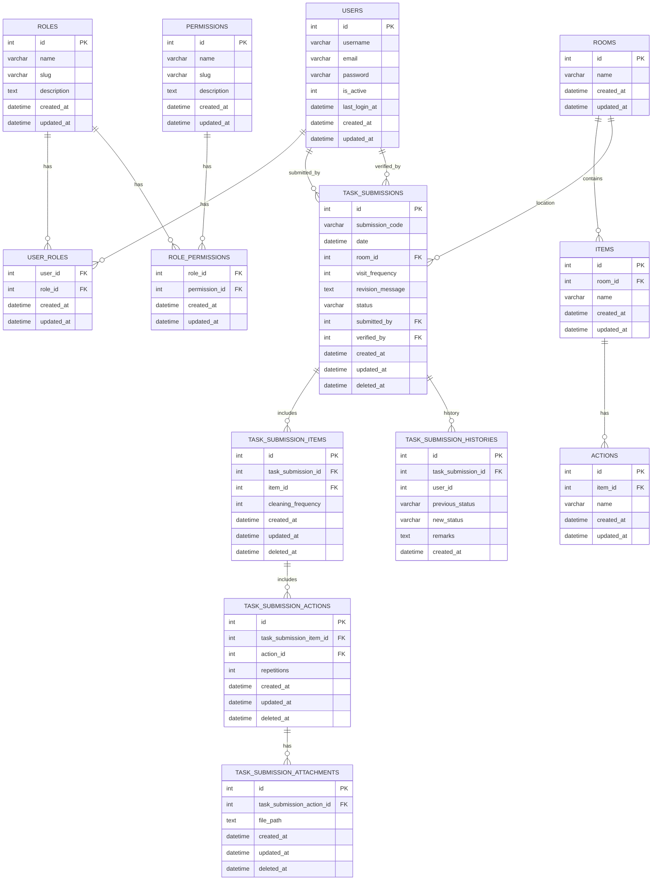

# Entity Relationship Diagram (Mermaid) — Bionic Backend

> Notes:
>
> - `status` on `task_submissions` stores values like `pending_review | revision_requested | approved | rejected` (see migration).
> - Many tables include `created_at`, `updated_at`, and some `deleted_at` for soft-deletes or tracking.
> - This diagram is based on migrations in `app/Database/Migrations`.
